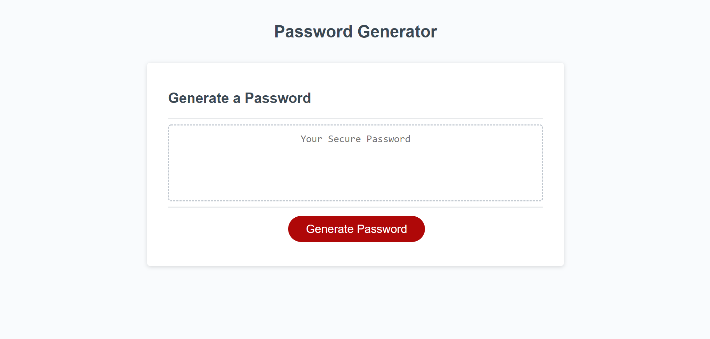

# Module 3 - Random Password Generator
## Description
Create a random password generator for users to use through the use of HTML and JS practices 

## Table of Contents
1. [Visuals](#visuals) 
2. [Usage](#usage)
3. [Link to site](#link-to-site)

## Visuals

## Usage
This random password generator is to be used for example purposes of generating a random set of letters, numbers and/or symbols. The code used focuses on JS practices learned during the third week of the module.

## Link to site
https://flipper5001.github.io/random-password-generator/

